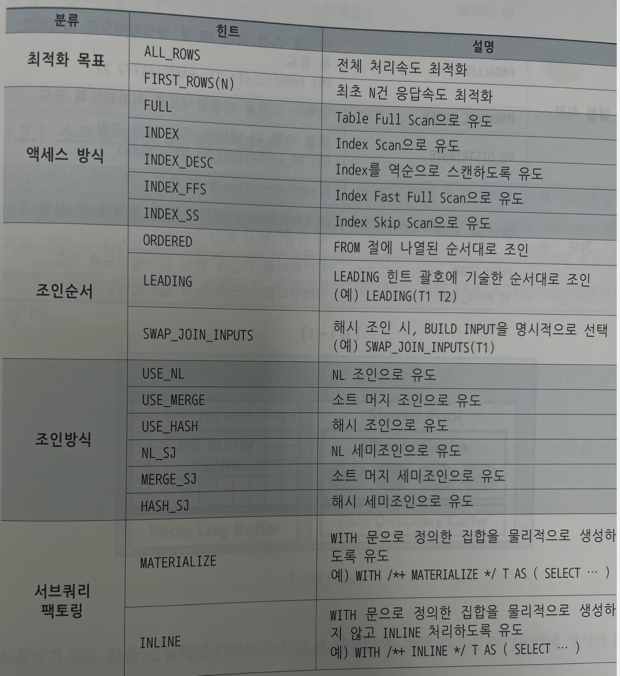
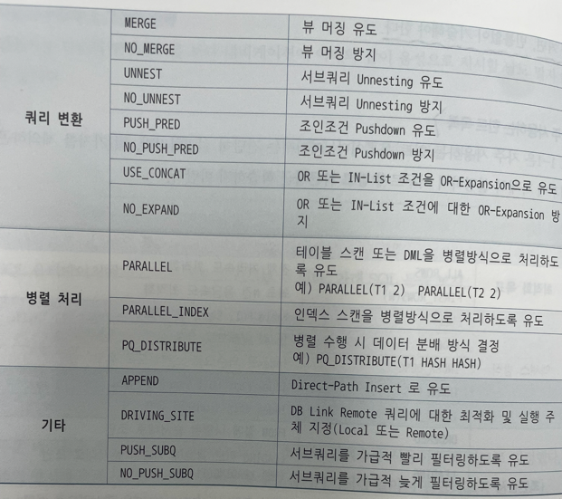
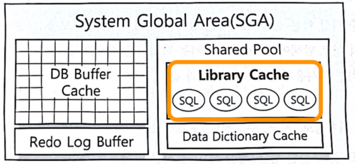
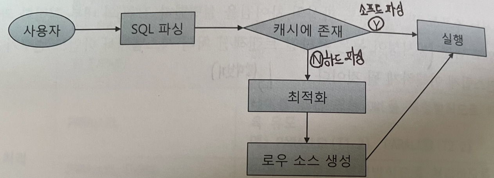
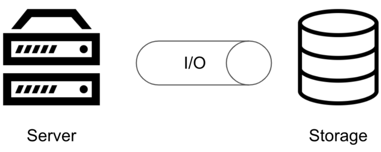
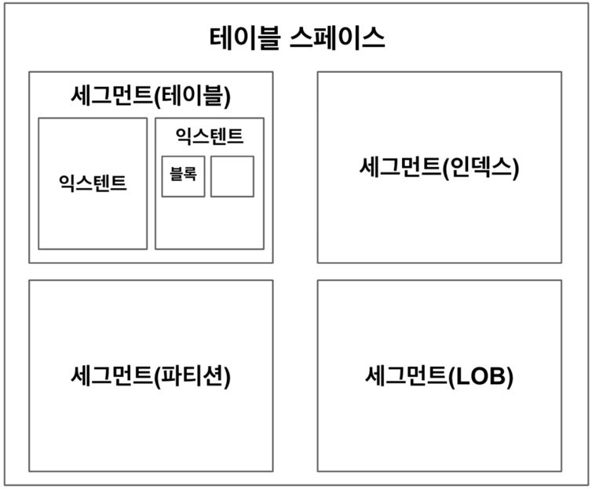

# 1장, SQL 처리 과정과 I/O
## 1.1 SQL 파싱과 최적화
구조적, 집합적, 선언적 질의 언어
SQL은 단어 그대로 구조적 질의 언어다.<br>해당 언어는 아래와 같은 순서로 실행된다.
>사용자 -> SQL -> 옵티마이저 -> 실행계획 -> 프로시저

원하는 결과집합을 구조적, 집합적으로 선언하지만, 그 결과집합을 만드는 과정은 절차적일 수 밖에 없다.<br>
즉, 프로시저가 필요하다. 그런 프로시저를 만들어 내는 DBMS 내부 엔진이 바로 SQL 옵티마이저다.<br>
옵티마이저가 프로그래밍을 대신해서 최적의 계획을 통해 프로시저를 작성한다.

### SQL 최적화
DBMS 내부에서 프로시저를 작성하고 컴파일해서 실행 가능한 상태로 만드는 전 과정<br>최적화 과정을 세분화.
1. SQL 파싱 : 문법적 오류, 의미적 오류(없는 테이블에 접근 등) 체크 후 파싱 트리 생성
2. SQL 최적화 : 옵티마이저가 이 단계를 수행한다. 다양한 실행 경로를 생성해서 비교한 후 가장 효율적인 경로를 선택한다.
3. 로우 소스 생성 : 옵티마이저가 선택한 경로를 실제 실행 가능한 코드 또는 프로시저 형태로 포맷팅한다.

### SQL 옵티마이저
사용자가 원하는 작업을 가장 효율적으로 수행할 수 있는 최적의 데이터 액세스 경로를 선택해주는 핵심 엔진이다. 
- 아래와 같은 최적화 단계를 거친다.
  1. 전달받은 쿼리의 후보가 될 만한 실행 계획들을 찾는다.(Decision Tree 형태)
  2. 위 실행 계획들의 예상 비용을 산정한다. 데이터 딕셔너리가 사용된다.
  3. 최저 비용을 나타내는 실행계획을 선택한다.

### 실행 계획과 비용
실행 계획 미리보기 기능을 통해 자신이 작성한 SQL이 테이블을 스캔하는지 인덱스를 스캔하는지, 어떤 인덱스가 사용되는지 등을 알 수 있다.

해당 경로의 비용을 근거로 테이블 또는 인덱스를 결정한다. 판단의 근거가 되는 비용은 어지까지나 에상치이다. 실측이 아니므로 차이가 발생한다.

트리구조로 표현된 것이 실행계획이다.

### 옵티마이저 힌트
옵티마이저 또한 항상 최적의 경로를 선택하지 않는다. 주어진 SQL이 복잡할 수록 더욱 최적의 경로를 선택하기는 어려워진다.(네비랑 똑같다)<br>
옵티마이저 힌트를 이용해 데이터 엑세스 경로를 변경시킬 수 있다.<br>
주로 아래와 같이 특정 인덱스를 사용하도록 힌트를 설정할 수 있다.<br>
힌트 사용법은 주석 기호에 `+`를 붙이면 된다.
```sql
select /*+ INDEX(A 주문일자)*/ 
	A.주문번호, A.주문금액, B.고객명, B.연락처, B.주소
from 주문 A, 고객 B
where ...
```
위 쿼리는 주문 테이블을 접근할 때 주문일자 컬럼이 선두인 인덱스를 사용하도록 힌트로 지정하였다.<br> 반면에 옵티마이저가 다른 방식을 선택하지 못하게 모든 접근에 힌트를 지정할 수도 있다.

#### 주의 사항
1. 힌트 안에 인자를 나열할 땐 `,`를 사용할 수 있지만, 힌트와 힌트 사이에 사용하면 안된다.
2. 테이블을 지정할 때 스키마 명까지 명시하면 안된다.
3. FROM 절 테이블명 옆에 ALIAS를 지정했다면, 힌트에도 반드시 ALIAS를 사용해야 한다.(이렇게 안쓰면 그 힌트는 무시 됌)

#### 자주 사용하는 힌트 목록



## 1.2 SQL 공유 및 재사용
동시성이 높은 온라인 트랜잭션 처리 시스템에서 바인드 변수가 왜 중요한지?

>동시성 높은 OLTP 시스템에서 바인드 변수는 실행 계획 재사용을 통해 성능을 극대화하고, 캐시 경합을 줄여 확장성을 보장하며, SQL 인젝션을 예방하기 위해 필수적이다.

<i>왜 ?</i>

#### 1. 실행 계획 캐싱으로 인한 성능 향상

- **문제**
    
    SQL 쿼리에 값이 직접 들어가면(리터럴), DB 옵티마이저가 매번 새로운 실행 계획을 세워야 함.
    
    → CPU/메모리 낭비, 파싱·컴파일 오버헤드 발생.
    
- **해결**
    
    바인드 변수를 사용하면 동일한 쿼리 텍스트가 재사용됨.
    
    옵티마이저가 만든 **실행 계획을 캐싱**해 재사용 가능.
    
- **성과**
    
    초당 수천~수만 트랜잭션이 발생하는 OLTP 환경에서 **파싱 부하 감소, 응답 지연 최소화**.

#### 2. 동시성 확장성 개선

- **문제**
    
    리터럴 값마다 실행 계획 캐시(shared pool, plan cache)에 새로운 엔트리가 쌓임 → 캐시 오염.
    
    캐시가 불필요하게 커져 **Latch 경합**(동시 접근 충돌)이 심해짐.
    
- **해결**
    
    바인드 변수 사용 시 동일한 SQL 구조를 공유.
    
    캐시에 쿼리 하나만 남고, 모든 세션이 이를 같이 씀.
    
- **성과**
    
    동시 세션이 수천 개 이상일 때도 캐시 효율이 유지되고 **락 경합이 줄어듦**.
    

#### 3. 보안 측면 (SQL Injection 방어)

- **문제**
    
    리터럴을 직접 붙이면 SQL 인젝션 취약점 발생 가능.
    
- **해결**
    
    바인드 변수는 값이 데이터로만 전달되므로 쿼리 구조가 변하지 않음.
    
- **성과**
    
    보안 사고 예방.
    

#### 4. 예시

```sql
-- ❌ 리터럴 사용
SELECT * FROM orders WHERE customer_id = 101;
SELECT * FROM orders WHERE customer_id = 102;
-- → 실행 계획 계속 새로 만듦

-- 바인드 변수 사용
SELECT * FROM orders WHERE customer_id = :customer_id;
-- → 실행 계획 한 번 생성 후 계속 재사용

```

**효과**
- 초당 1만 TPS 환경에서 리터럴 SQL → CPU 사용률 90%까지 치솟음.
- 동일 환경에서 바인드 변수 적용 → CPU 사용률 50% 이하로 절감 (실무 DB 튜닝 사례에서 흔히 보고됨).

---

### 소프트파싱 vs 하드파싱

옵티마이저가 최적화를 통해 생성한 내부 프로시저를 재사용하도록 캐싱해두는 공간이 아래 이미지의 Library Cache 이다.<br> SGA는 주로 오라클 DBMS에서 사용되는 개념이며 클라이언트의 요청을 처리하는 서버 프로세스와 이를 보조해주는 BG 프로세스에서 해당 영역에 접근한다. <br>참고로 RDBMS를 구동할 경우 여러 프로세스에 의해 구동된다.


사용자의 SQL이 파싱되면 해당 SQL이 라이브러리 캐시에 존재하는지 확인한다.<br> 이후 cache-hit인 경우 해당 로우소스를 사용하고 cache-miss인 경우는 로우 소스를 생성하기 위한 과정을 옵티마이저가 수행한다.<br> <SQL문, 로우소스> 형태의 key-value로 캐시가 구성된다고 이해하였다.



캐시가 적중할 경우 이를 소프트 파싱이라 하고 미스가 발생할 경우는 하드 파싱이라고 한다. <br>하드 파싱의 경우 SQL 최적화 과정을 거치는데 이러한 작업이 많은 오버헤드를 수반하여 “하드” 라는 의미가 부여되었다.

옵티마이저가 하나의 쿼리를 최적화 하기 위해 아래와 같은 다양한 정보들을 사용한다.

- 테이블, 컬럼, 인덱스 구조에 관한 기본 정보
- 오브젝트 통계
- 시스템 통계
- 옵티마이저 관련 파라미터

이러한 정보들을 활용해 다량의 CPU 연산을 처리해줘야한다. IO 작업에 비하면 미비할 지는 몰라도 연산 자체의 양이 많기에 캐싱 전략을 사용한다.<br>

db에서 이뤄지는 처리 과정은 대부분 I/O 작업에 집중, 하드 파싱은 CPU를 많이 소비하는 몇 안되는 작업 중 하나.<br>
**라이브러리 캐시가 필요한 이유** : 이렇게 hard 작업을 거쳐 생성한 내부 프로시저를 한 번만 사용하고 버린다면 이만저만 비효율이 아니다.

### 바인드 변수의 중요성
앞서 살펴본 라이브러리 캐시는 <SQL문, 로우소스> 형태로 저장된다.

만약 여기서 아래와 같은 jdbc 코드가 수많은 요청을 동시에 받으면 어떻게 될까?

```java
public void login(String id) throws Exception {
	String SqlStmt = "SELECT * FROM CUSTOMER WHERE LOGIN_ID = " + id + "'";
	//쿼리 실행 로직...
}
```

아마 배운대로라면 아래 SQL 전부에 대한 각각의 하드 파싱이 적용된다. 왜냐하면 캐시의 키값이 다르기 때문이다.
```sql
SELECT * FROM CUSTOMER WHERE LOGIN_ID = 'brido'”
SELECT * FROM CUSTOMER WHERE LOGIN_ID = 'daeback'”
```
즉,I/O 연산이 아닌 CPU 연산에 의한 부하로 인해 장비의 리소스가 급격히 사용됨을 예상해볼 수 있다.

이를 해결하기 위해 jdbc에서 아래와 같이 `?` 인자를 사용한다.
```java
public void login(String id) throws Exception {
	String SqlStmt = "SELECT * FROM CUSTOMER WHERE LOGIN_ID = ?";
	PreparedStatement st = con.prepareStatement(SqlStmt);
	st.setString(id);
	//...	
}
```
위와 같이 적용할 경우 `"SELECT * FROM CUSTOMER WHERE LOGIN_ID = ?"`에 해당하는 로우 소스를 최초 한번만 하드 파싱하고 이후 모든 요청들이 재사용할 수 있다.

## 1.3 데이터 저장 구조 및 I/O 메커니즘
I/O 튜닝이 곧 SQL 튜닝이다.
IO 작업의 경우 SQL 작업이 느린 주된 원인이다. 그럴 수 밖에 없는게 IO 요청을 보내게 될 경우 해당 프로세스는 Blocking되어 대기 상태에 들어간다. I/O 호출 속도는 아래와 같다.

- Single Block I/O : 평균 10ms -> 초당 100개 블록 정도(1블록 당 10ms)
- SSD 활용 I/O : 1ms에서 2ms

### 데이터 베이스 저장 구조
#### SQL이 느린 이유는 무엇일까?
컴퓨터 구조 과목을 배우던 때를 기억해보자. <br>
디스크 I/O는 느리기 때문에 컴퓨터는 메모리 혹은 레지스터를 활용하였다. DB역시 마찬가지이다. DBMS는 DB서버와 스토리지로 나뉘는데 스토리지에서 데이터를 읽어올 때 디스크 I/O 가 발생한다. I/O가 발생하면 프로세스는 대기 큐에서 sleep하고 있기 때문에 I/O가 많아지면 성능이 느려질 수 밖에 없다. <br>결국 본질적으로 SQL을 최적화 한다는 것은 DISK I/O를 줄이는 것을 의미한다.


#### 데이터 베이스의 데이터 저장 구조

데이터를 저장하려면 테이블 스페이스가 필요하다.<br> 테이블 스페이스는 세그먼트를 담는 컨테이너이다. <br>세그먼트는 테이블,인덱스처럼 데이터의 저장공간이 필요한 오브젝트이다.<br>이러한 세그먼트는 여러개의 익스텐트로 구성된다. 익스텐트는 공간을 확장하는 단위이다.테이블이나 인덱스에 데이터를 입력하다가 공간이 부족할 경우 테이블 스페이스로부터 추가로 할당받는다. 동시에 익스텐트는 연속된 블록들의 집합이다. 블록은 사용자가 입력한 레코드가 실제로 저장되는 공간이다. 또한 한 블록은 한 테이블이 독점한다.<br>즉, 하나의 블록에 저장된 레코드들은 모두 같은 테이블의 레코드들이다.

그러면 실제 데이터파일에 익스텐트들이 저장이 될 텐데, 연속된 익스텐트들이 존재할 경우 모두 같은 하나의 데이터 파일에 저장될까? 아니다. <br>이들은 서로 다른 데이터 파일에 위치할 가능성이 높다.<br> 왜냐하면 하나의 파일에 여러 익스텐트들이 구성될 경우 파일을 읽으려는 경합이 증가할 수 있기 때문이다.<br> 앞서 나온 용어들을 간략히 정리하자.

- 블록 : 데이터를 읽고 쓰는 단위
- 익스텐트 : 공간을 확장하는 단위, 연속된 블록의 집합
- 세그먼트 : 데이터 저장공간이 필요한 오브젝트(테이블, 인덱스, 파티션 ,LOB)
- 테이블 스페이스 : 세그먼트를 담는 컨테이너
- 데이터 파일 : 디스크 상의 물리적인 OS 파일

#### 블록 단위 I/O
앞서 언급된 것처럼 데이터를 읽고 쓰는 단위가 블록이다.<br> 그러므로 특정 레코드 하나만 읽고 싶다고 해도 해당 레코드가 포함된 블록을 통째로 읽어야한다.

테이블뿐만 아니라 인덱스 또한 특정 레코드를 찾아내 읽을 때 해당 레코드가 담긴 블록 단위로 읽는다.

#### 데이터 액세스 방법
테이블 또는 인덱스 블록을 읽는 방식으로는 시퀸셜 액세스와 랜덤 액세스가 존재한다.

- 시퀸셜 액세스 : 논리적 혹은 물리적으로 블록들이 연결된 순서에 따라 차례대로 블록을 읽는 방식이다.
- 랜덤 액세스 : 레코드 하나를 읽기 위해 한 블록씩 접근하는 방식이다. 인덱스를 통해 데이터를 읽을 때 사용되는 방식이다.
이와 관련되어 데이터를 스캔하는 방식은 다음과 같다.

- Table Full Scan : 테이블에 속한 블록 전체를 읽어서 사용자가 원하는 데이터를 찾는 방식이다. 시퀸셜 액세스를 통해 읽는다.
- Index Range Scan : 인덱스에스 일정량을 스캔하면서 얻은 ROWID로 테이블 레코드를 찾아가는 방식이다. 랜덤 액세스를 통해 읽는다.
  논리적 I/O vs 물리적 I/O
  
### 논리적 I/O vs 물리적 I/O
앞서 살펴본 Library Cache 이미지에서 DB Buffer Cache 영역이 있었다.<br>  라이브러리 캐시가 SQL과 실행계획,프로시저 캐싱하는 영역이라고 한다면 DB 버퍼 캐시는 데이터 캐시라고 할 수 있다.<br>  이는 디스크 블록으로부터 읽은 데이터를 캐싱해 두어 같은 블록에 대한 반복적인 I/O 작업의 횟수를 줄여준다.

논리적 I/O라고 함은 SQL문을 처리하는 과정에서 메모리 버퍼 캐시에서 발생하는 총 블록 I/O를 의미한다. <br> 반면 물리적 I/O라고 함은 디스크에서 발생한 총 블록 I/O를 의미한다.<br>  캐시 메모리는 보통 물리 메모리에 존재하기에 디스크 I/O에 비해 약 10,000배쯤 빠르다.

SQL을 수행하려면 데이터가 담긴 블록을 읽어야 한다. 특정 SQL이 참조하는 테이블에 변경이 없고 같은 변수를 입력하면, 몇번을 수행해도 매번 읽어야 하는 블록 수는 같다.<br>  SQL을 수행하면서 읽은 총 블록 I/O의 수가 논리적 I/O다. <br> 그러면 앞서 절에서 왜 논리적 I/O가 메모리 버퍼 캐시에서 발생하는 블럭 I/O의 수라고 표현했을까? Direct Path Read 방식으로 읽는 경우를 제외하면 모든 블럭은 DB 버퍼 캐시를 경유해서 읽는다. 따라서 논리적 I/O의 횟수는 DB 버퍼 캐시에서 블록을 읽은 횟수와 동일하다.

반면 만약 캐싱에 실패해 블록에서 찾지 못하면 디스크에서 해당 블록을 읽어오고 이를 물리적 I/O라 한다.<br>  앞선 조건처럼 테이블의 데이터 변경이 없고 같은 변수를 입력하더라도 물리적 I/O는 동일한 SQL이라하더라도 달라질 수 있다.<br>  첫번째 요청에 물리적 I/O보다 그 다음 요청은 물리적 I/O가 감소할 수 밖에 없다.

흔히 SQL을 튜닝한다는것은 논리적 I/O를 감소시켜 가져오는 블록 자체를 감소시키는것을 의미한다.<br>  물리적 I/O의 경우 매 요청마다 고정된 값이 아니기에 튜닝의 대상이 되기 어렵다. <br> 그래서 논리적 I/O 자체를 감소시키면 자연스레 통제 불가능한 변인인 물리적 I/O 또한 감소하게 된다.

#### Single Block vs MultiBlock IO
캐시에서 찾지못한 블록의 경우 디스크로부터 DB 버퍼캐시로 적재하고 나서 읽는다.

이때 발생하는 I/O 요청이 한 번에 한 블록씩 요청하기도 하고 여러 블록씩 요청하기도 한다. 

한 요청의 한 블럭을 Single Block이라고 한 요청에 여러 블록을 가져올 때는 MultiBlcok이라고 한다.

인덱스를 이용할 경우 기본적으로 인덱스와 테이블 블록 모두 Single Block 방식을 사용한다.

인덱스는 주로 소량의 데이터를 읽는 경우가 많으므로 이 방식이 효율적이다.

반대로 많은 데이터 블록을 읽을 때는 MultiBlock 방식이 효율적이다.<br> 
그래서 인덱스를 이용하지 않고 테이블 전체를 스캔할 때 이 방식을 사용한다.

한번에 많은 블럭이 필요할 때 한 블럭씩 가져오게 되면 결국 I/O 요청에 의한 블록킹이 발생하여 요청 시간이 길어지게 된다.이러한 점 때문에 특정 블록과 그 근처 블록들을 한꺼번에 읽어들이는 MultiBlock이 효율적인 경우도 존재한다.

#### 메모리 퍼버 캐시 탐색
버퍼 캐시는 SGA의 구성 요소임으로 캐싱된 버퍼 블록들은 공유 자원이다. 즉, 여러 프로세스로부터 동시에 특정 블록에 접근하는 경우가 발생한다. 따라서 자원을 공유하는것처럼 보여도 실제로 내부에서는 한 프로세스씩 순차적으로 접근하도록 구현하는 직렬화를 제공한다.(직렬화를 ‘줄 세우기’라고 표현했고 이해하기 쉬운것 같다) 프로세스간의 순서를 보장하기 위해 캐시버퍼 체인 래치를 제공한다


### 인덱스는 항상 빠르지 않다.
일반적으로 우리는 인덱스를 쓰면 조회할 때 성능이 올라가는 것으로 알고 있다. 그 이유는 인덱스는 특정 조건에 맞는 데이터를 B+트리와 같은 자료구조를 통해 단 시간에 빠르게 찾을 수 있기 때문이다.

그러나 인덱스 컬럼의 조건에 맞는 데이터 양이 전체 데이터 양에 꽤 많은 portion을 차지하고 있다면 인덱스를 통한 Index Range Scan(랜덤 액세스)가 인덱스를 사용하지 않고 전체 테이블 블록을 읽어오는 Full Scan보다 느릴 수 있다.

Table Full Scan은 Multi Block I/O 방식으로 디스크 블록을 읽는다. 한 블록에 속한 모든 레코드를 한번에 읽어들이고, 캐시에서 못 찾으면 한 번의 IO를 통해 인접한 수십 수백개의 블록을 한번에 I/O하는 메커니즘이다.

Index Range Scan을 통한 테이블 액세스는 랜덤 액세스와 SIngle Block I/O 방식으로 디스크 블록을 읽는다. 캐시에서 블록을 못찾으면, 레코드 하나를 일기 위해 매번 잠을 자는 I/O 메커니즘이다. 즉 많은 데이터를 읽을 때 Table Full Scan 보다 불리하다. 또 읽었던 블록을 반복해서 읽기 때문에 비 효율적이다.


# if

### 1. “SQL은 결과는 같아도 실행 방법이 달라지며, 잘못된 계획은 성능 저하를 만든다.”
→ 병목 지점 파악과 읽기 최소화가 핵심 과제다.

### 2. 예시
```sql
SELECT * 
FROM 주문 o
JOIN 고객 c ON o.cust_id = c.id
WHERE c.region = '서울';

```
- 옵티마이저 선택 계획
  - 고객 테이블 Full Scan (10만건)
  - 주문 테이블 NL Join 반복 (100만건 접근)
- 결과: 과도한 I/O 발생

### 3. 원인 분석
- 고객.region 컬럼에 인덱스 없음 → 조건절이 풀스캔 유발
- 고객 건수 많음 → 조인 시 주문 테이블 랜덤 I/O 폭증
- 옵티마이저가 비용 계산을 잘못 추정하여 비효율 계획 선택

### 4. 해결 방법
1. 고객(region)에 인덱스 생성 → 선택도 높은 조건을 먼저 줄이기

`CREATE INDEX idx_customer_region ON 고객(region);`
2. 조인 순서 변경 → 고객 소수 → 주문 연결
3. 통계 갱신으로 옵티마이저 정확한 카디널리티 추정

### 5. 전후 비교
```html
구분	응답시간	논리 I/O	CPU 사용량
개선 전	1.8초	120,000	높음
개선 후	0.18초	18,000	85%↓
```
### 6. 성과

- 응답속도 10배 개선
- I/O 85% 감소, CPU 자원 절약
- 바인드 변수 적용 → 계획 캐싱 가능

### 7. 느낀점
1. SQL 튜닝은 읽는 양 최소화 원칙이 전부다.
2. 실행계획을 보고 병목을 찾는 습관이 중요하다.
3. 중요한 점은 “인덱스 조건 적중”과 “조인 순서”만 확실히 이해해도 실무에 바로 적용 가능하다는 것이다.

# 친절한 SQL 튜닝 1장 요약

## 1) 챕터 핵심 요약 (개념·원리·키워드)

- **성능 목표**: 응답시간(Latency)↓, 처리량(TPS/QPS)↑, 자원CPU/IO↓, 비용↓
- **병목의 3대 축**
  - CPU(연산/정렬)  
  - I/O(테이블/인덱스 스캔)  
  - 카디널리티 추정(옵티마이저 오판)
- **옵티마이저**: 비용 기반(CBO)으로 통계(카디널리티·선택도·히스토그램)를 이용해 실행계획을 고른다
- **핵심 키워드**  
  `Index Range Scan`, `Full Scan`, `Nested Loop / Hash Join / Merge Join`, `Sort`, `Filter`, `Predicate Pushdown`
- **파싱 경로**: 파싱 → 바인드 → 최적화 → 실행 → 페치
- **주의**: 하드파싱 남발 금지, 바인드 변수 사용으로 계획 재사용
- **좋은 SQL의 원리**: “읽는 양을 최소화” = 필요한 로우만, 필요한 컬럼만, 적절한 인덱스
- **튜닝 절차**: 증상 수집 → 실행계획 확인 → 과도 I/O 지점 찾기 → 액세스 경로/조인순서/조인방식 교정 → 검증/회귀 체크

**요약 그림**  
```
문제 SQL → (실행계획/대기이벤트) 
        → 병목구간 식별 
        → 인덱스/조인/필터/정렬 개선 
        → 재측정
```


## 2) 백엔드 주니어 필수 포인트 (실무 핵심)

- WHERE-절 인덱스 적중: 선두컬럼 정렬·동등조건 우선, 함수/형변환 금지(= 인덱스 무력화)
- 조인 순서: 선행 테이블의 카디널리티가 작게 나오도록 조건/인덱스 설계
- 커버링 인덱스: 자주 쓰는 조회는 포함 컬럼으로 테이블 접근을 줄인다
- 페이징 튜닝: OFFSET 큰 경우 Seek 방식(이후 키 기준) + 커버링 인덱스, 또는 키셋分页
- N+1 방지: 조인/배치조회, 캐시(읽기 집약 시)
- DB 네트워크 왕복수↓: JDBC fetchSize 조정, 벌크/배치 insert, 불필요 select 제거
- 바인드 변수: 계획 재사용, 하드파싱 억제(특히 동적 SQL 남발 금지)


## 3) 면접/실무/이력서 연결 (꼬리질문·사례·적용)

- **사례 포맷**: 문제 – 원인 – 해결 – 성과  
- **예시**: “주문 목록 페이징이 1.8s → 키셋分页 + 커버링 인덱스로 180ms, I/O 85%↓”

### 성능/안정성/확장성 포인트
- 성능: 인덱스 설계(선택도↑), 조인 순서 고정(힌트/통계), 정렬 회피
- 안정성: 바인드 변수로 계획 폭주 방지, 배치로 락 경합 완화
- 확장성: 읽기 부하 캐시·리플리카, 리포트용 별도 인덱스

### 꼬리 질문 예
- 왜 `LIKE '%키워드'`가 느린가? → 선두 와일드카드로 인덱스 스캔 불가
- NL vs Hash Join 선택 기준은? → 한쪽 소량/랜덤 I/O vs 대량/해시빌드 메모리
- 통계가 틀리면? → 히스토그램/통계 갱신, 고정 플랜/힌트, 리라이트


## 4) 추가로 알면 좋은 지식 (확장·심화)

- 카디널리티 추정 실패 패턴: 다중 조건 상관관계, 편향 분포 → 히스토그램/가상열/부분지표
- 정렬 비용 회피: 인덱스 정렬 순서 맞추기, 불필요 `ORDER BY` 제거
- 필터 푸시다운: 조인 전 필터 최대 적용(서브쿼리 Unnesting, 세미조인)
- 파티셔닝: 범위/해시로 스캔 영역 축소 (실제 핫 파티션 주의)


## 5) 면접 예상 질문 정리

### 기본
- CBO가 계획을 고르는 근거는? → 통계·비용
- 인덱스가 있어도 느릴 수 있는 이유는? → 선두불일치/함수/형변환/선택도 낮음

### 꼬리
- OFFSET 100000이 느린 이유와 대안? → 키셋分页/커버링 인덱스
- `count(*)` 최적화 방법? → 적절한 인덱스/카운트 전용 테이블/캐시

### 실무 시나리오
- 배치성 리포트 쿼리가 낮에 느려짐 → 실행계획/대기이벤트로 정렬/해시 스필 확인 → 야간 미리 집계·인덱스 정렬 최적화로 해결
- 특정 값 편향으로 풀스캔 발생 → 히스토그램 구축 후 선택 계획 안정화
